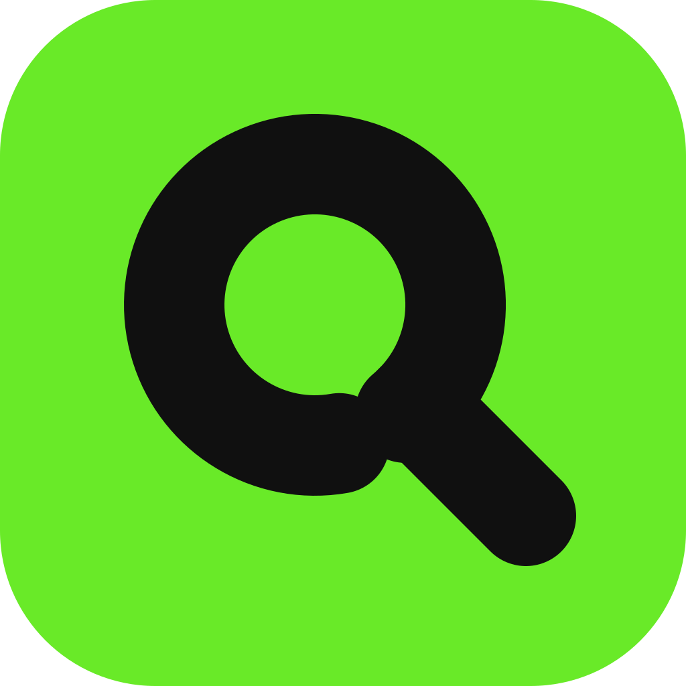
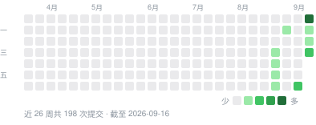

<div align="center">



# QuotaBar

**每个 AI 编码额度，抬眼就看见——在菜单栏、刘海、屏幕边缘或桌面上。**

[](https://github.com/QuotaBar/QuotaBar/releases/latest)
[](https://github.com/QuotaBar/QuotaBar/releases)
[](https://github.com/QuotaBar/QuotaBar/stargazers)
[](https://github.com/QuotaBar/QuotaBar/commits/main)
[](https://github.com/QuotaBar/QuotaBar/graphs/commit-activity)
[](https://github.com/QuotaBar/QuotaBar/actions/workflows/ci.yml)
[](https://github.com/QuotaBar/QuotaBar/releases/latest)
[](LICENSE)

QuotaBar 是一款 macOS 菜单栏应用，显示每个 AI 编码服务的额度用了多少、各个窗口何时重置、
大约花了多少钱。支持 23 个服务商，全部在你自己的 Mac 上读取和计算。无需注册账号，没有任何统计上报。

[下载](https://github.com/QuotaBar/QuotaBar/releases/latest) ·
[官网](https://quota.bar) ·
[更新日志](CHANGELOG.md) ·
[架构说明](ARCHITECTURE.md)

[English](README.md) · **简体中文**

</div>

---

## 安装

```bash
brew tap gentpan/tap
brew trust gentpan/tap      # Homebrew 6 需要先信任第三方 tap
brew install --cask quotabar
```

也可以从 [Releases](https://github.com/QuotaBar/QuotaBar/releases/latest) 下载 `.dmg`，
把 `QuotaBar.app` 拖进「应用程序」。安装包使用 Developer ID 证书签名并经过 Apple 公证，
Gatekeeper 可以直接打开。

需要 macOS 14（Sonoma）或更高版本，支持 Apple 芯片和 Intel。界面提供英文和简体中文，
默认跟随系统语言，也可以在设置里指定。

## 最近更新

<!-- changelog:start -->
<!-- 由 Scripts/sync_changelog.py 从 CHANGELOG.md 生成，请勿手改。 -->

最新版本 **0.5.10**（2026-09-21） · 开发中 **5** 项改动尚未发布 · [完整更新日志](CHANGELOG.md)

<details open>
<summary><b>2026-09-21</b> · 未发布 · 修复 5</summary>

**修复**

- 刘海岛为它没显示的服务商报警：每侧只显示 1 个时，岛上只有 Codex 和 Claude 两个数字，但轮廓的红色闪烁、光晕变色和「越线时自动弹出」看的是所有允许上岛的服务商。Cursor 用到 99.8% 时，岛一直闪红，岛上的两个数字却都很空，看上去像是这两个账户出了问题。现在岛只为它显示出来的服务商说话：闪烁、光晕、自动弹出、额度重置横幅都只针对岛上画出来的那几个；没显示的服务商用完了，岛不再有任何反应（下拉面板、停靠条和系统通知照旧）。无刘海屏幕上的药丸也改为跟随「每侧显示」，每侧 1 个时显示两个数字（原来固定三个）。
- 鼠标移到刘海岛上，有时展开、有时没反应、有时展开了又自己收起。查到六个原因，一起修了：- 把鼠标甩到屏幕最顶端（够到刘海最自然的动作）时，指针的纵坐标正好等于岛的上边缘，而判定把上边缘算在岛外，于是整个岛对鼠标失效；已经展开的面板只要指针往上一顶也会立刻收起。- 岛「接不接收鼠标」只在鼠标移动时重新判断，而且用的是动画进行中的窗口大小。面板向下展开的 0.34 秒里，指针往下移进还没长到位的面板，会被判成「离开了」。现在按展开后的最终形状判断，并且每次形状变化后立刻重判一次。- 悬停状态原来要等指针进入后的下一次移动才被察觉，指针一停就永远等不到。现在由同一套位置判断直接驱动。- 收起的岛只有菜单栏那么高，手稍微蹭出边缘，0.5 秒的悬停等待就从头再来。现在蹭出去 0.12 秒内回来不算离开。- 面板开始收起后（0.3 秒动画），把指针移回还看得见的面板，它照样关完，还要重新等 0.5 秒。现在移回来就是留住它。离开后的等待时间也从 0.25 秒改为 0.32 秒，与边缘停靠条一致。- 展开和收起时，条带与面板是在一帧里硬切的，轮廓外的留白也是一帧跳变（原来那段过渡代码实际上从未生效）。现在两者交叉淡入淡出，留白跟着窗口同一条曲线走，面板内容裁在轮廓之内。
- 在设置里关掉再打开刘海岛后，光晕和闪烁可能永久停住；额度重置横幅还在时关掉再打开，岛会高出一截再自己缩回去。两处都已修复。
- 系统开启「减少动态效果」时，刘海岛的窗口仍在缓动，内容却已就位，两者错开。现在窗口也立即到位。
- 下拉面板关闭后不再留着内容：面板只是隐藏，里面的视图会继续活着，任何一个每帧动画都能在看不见的情况下一直占 CPU。现在关闭时连同内容一起释放，下次打开重新构建。

</details>

<details>
<summary><b>2026-09-21</b> · 0.5.10 · 修复 3</summary>

**修复**

- 关于页的 GitHub 链接、反馈入口、检查更新和更新内容里的问题编号，都改到仓库的新地址 QuotaBar/QuotaBar，不再绕旧地址跳转；配置里仍写着旧地址的更新源照常工作，也照常走 quota.bar 的下载镜像。
- 刘海岛在空闲时一直占用 CPU（约 8% 的单核，屏幕上什么都没变也照样占）：收起状态下沿轮廓转的那道光原本一秒重画 30 次，现在默认只在读取数据、鼠标悬停、弹出横幅和接近上限时转，空闲时停下。想一直转可以在设置 → 显示方式 → 刘海岛里打开「光晕一直转」，开关的说明里写明了代价。轮廓外的柔光照常显示，不受影响。（[#5](https://github.com/QuotaBar/QuotaBar/issues/5)）
- 打开过一次下拉面板后，应用会一直占用约五分之一个核，关掉面板、屏幕上什么都不显示也照样占：面板里那个会跳动的花费数字，判断「是否暂停」用的是视图里的时钟，而这个值只在建立动画时读一次，于是它每秒重画 60 次，一直画到应用退出。没开刘海岛的 Mac 上，这一条就是全部原因。同时，额度快用完时的边框闪烁也改成由系统动画绘制，不再每帧重算。

</details>

<details>
<summary><b>2026-09-19</b> · 0.5.10 · 样式 1</summary>

**样式**

- Codex 卡片里的「gpt-reserve」改名为「备用 · Luna」。这是 OpenAI 给 Codex 的备用额度：套餐本身的额度用完后，Codex 会改用 Luna（更快、适合简单任务的模型），消耗这份单独按周计算的额度，直到套餐额度重置。以前卡片上只显示接口里的原名，看不出是什么。现在显示中文名，模型名从接口读取，换了备用模型会跟着变；鼠标停在名称上会显示这段说明。正在使用备用额度时，名称旁有绿色「使用中」标签，这一行也会一直显示在卡片上，不会被收进折叠区；不在使用时仍按你在「卡片上显示的额度」里的选择。你已有的隐藏、圆环跟随等设置不受影响。

</details>

<!-- changelog:end -->

## 项目动态

<p align="center">
  
</p>

<p align="center">
  <a href="https://star-history.com/#QuotaBar/QuotaBar&Date">
    <picture>
      <source media="(prefers-color-scheme: dark)" srcset="https://api.star-history.com/svg?repos=QuotaBar/QuotaBar&type=Date&theme=dark">
      
    </picture>
  </a>
</p>

## 服务商

| 服务商 | 数据来源 | 凭据 |
|---|---|---|
| Codex | `~/.codex/auth.json` OAuth → `chatgpt.com/backend-api/wham/usage` | 自动 |
| Claude | Claude Code 钥匙串项 → `api.anthropic.com/api/oauth/usage` | 自动 |
| Gemini | `~/.gemini/oauth_creds.json` → `cloudcode-pa.googleapis.com` | 自动 |
| Grok | `~/.grok/auth.json` → `cli-chat-proxy.grok.com/v1/billing` | 自动 / 手动 |
| Antigravity | `~/.gemini/jetski-standalone-oauth-token` → `cloudcode-pa.googleapis.com` | 自动 |
| Cursor | Cursor 自己的 `state.vscdb` 会话 → `cursor.com/api/usage-summary` | 自动 / 手动 |
| OpenCode Go | `~/.local/share/opencode/auth.json` → `opencode.ai/zen/go/v1/usage` | 自动 / 手动 |
| Kimi Code | Kimi Code 应用 / CLI 登录（`~/.kimi-code/credentials`）→ `api.kimi.com` / `api.kimi.ai` `/coding/v1/usages`，或用 `kimi-auth` JWT 读 `kimi.com` 计费网关 | 自动 / 手动 |
| z.ai | `api.z.ai/api/monitor/usage/quota/limit` | 手动填写 API Key |
| MiniMax | `api.minimax.io` 编码套餐余量 | 手动填写 token / Cookie |
| Manus | `api.manus.im` 额度 | 手动填写会话 token |
| DeepSeek | `api.deepseek.com/user/balance` | 手动填写 API Key |
| Qwen Cloud | `home.qwencloud.com` 控制台 → token 套餐用量 | 手动填写 Cookie 请求头 |
| GitHub Copilot | GitHub CLI 登录 (`gh auth token`) → `api.github.com/copilot_internal/user` | 自动 / 手动 |
| 阿里云百炼 Coding Plan *（实验性）* | 百炼控制台网关 → 编码套餐额度 | Cookie 请求头 / 应用内登录 |
| 火山方舟 *（实验性）* | `arkcli usage plan --format json` | 自动（arkcli 登录） |
| 智谱 GLM *（实验性）* | `open.bigmodel.cn/api/monitor/usage/quota/limit` | 手动填写 API Key |
| Kimi 开放平台 *（实验性）* | `api.moonshot.cn/v1/users/me/balance` | 手动填写 API Key |
| OpenRouter *（实验性）* | `openrouter.ai/api/v1/credits` + `/key` | 手动填写 API Key |
| 小米 MiMo *（实验性）* | `platform.xiaomimimo.com/api/v1` 余额 + token 套餐 | Cookie 请求头 / 应用内登录 |
| Qoder *（实验性）* | `qoder.com/api/v2/me/usages/big_model_credits` | 手动填写 Cookie 请求头 |
| Windsurf *（实验性）* | Windsurf 自己的 `state.vscdb` 缓存套餐 | 自动 |
| Kiro *（实验性）* | `kiro-cli` 会话 → AWS `GetUsageLimits` | 自动 |

标为*实验性*的服务商按各家控制台和命令行工具的接口实现，但还没有用真实账号验证过，
设置里会同样标注。

**正常情况下不会弹窗。** Claude 是唯一一个把登录会话存放在*另一个应用*钥匙串项里的服务商。
QuotaBar 和 Claude Code 自己一样，通过 `/usr/bin/security` 读取；该工具写入的每个钥匙串项都信任它，
所以无论安装包用什么签名，macOS 都不需要询问。只有这次读取被拒绝时，才会出现
**允许访问钥匙串** 按钮；后台刷新从不弹出系统对话框，只有点这个按钮时才会。

## 在哪里看额度

**菜单栏与下拉面板**
- 11 种图标样式，其中 4 种是*阶梯*式，格数可以直接数出来，读数更准；也可以只显示文字、
  只显示 logo，或完全隐藏。
- 图标把**短周期**（5 小时滚动窗口）和**长周期**（每周、账单周期）分开显示，
  合在一起就看不出到底是哪个额度快用完了。
- 点击图标打开面板。顶部是花费卡片，可切换花费、token 数或每百万 token 花费，
  时间可选今日、昨日或 30 天，并按命令行工具拆分。下面每个服务商一张卡片，
  显示最重要的两个额度窗口；其余窗口、趋势、30 天花费和状态页收在展开区里。
- 点任意百分比在已用和剩余之间切换，点重置时间在倒计时和具体时刻之间切换。
  右键卡片可以复制为图片。
- `Esc` 关闭，`⌘R` 全部刷新，`⌘,` 打开设置。还可以设置全局快捷键，在任何地方打开面板。

**刘海岛**：带刘海的 Mac 上，数字显示在刘海两侧。鼠标悬停展开，有额度、用量、总览三页，
图表有五种样式。额度接近告警线时，光晕从蓝色渐变为琥珀色和红色；第一次越过告警线时，
刘海岛会自动弹出。低功耗模式下只在有变化时发光。

**屏幕边缘停靠条**：平时隐藏，鼠标移到屏幕边缘时出现。双击某个窗口（5 小时、每周、
某个模型单独的额度），选择圆环显示哪一个。

**桌面卡片**：数量不限，默认放在桌面上、窗口下方，也可以保持在最前。有大数字、仪表、
花费趋势、每日对比、服务商网格、快用完排行和经典列表几种样式，每种都有小、中、大三个尺寸。
拖动可移动，双击打开面板，右键可更换样式、尺寸或服务商。

接了两块屏幕时，可以选择刘海岛、停靠条和桌面卡片显示在哪块屏幕上。

## 节奏、提醒与花费

- **节奏**：每条进度条上有一条细竖线，标出匀速使用时此刻应在的位置。预计余量很紧时会提示；
  预计重置前用完时显示火苗和用完时间。
- **提醒**：告警和严重两档阈值，外加"快用完""余量很紧""重置前会用完"三种节奏提醒；
  每次越线只提醒一次，每个重置周期也只提醒一次。
- **额度重置**：窗口一重置，QuotaBar 立刻重新读取该服务商，并用该服务商的颜色标出来：
  停靠条滑出、圆环被扫满并弹出卡片，刘海岛展开「额度已重置」横幅，菜单栏图标回满并闪过一道高光，
  对应额度行显示「刚刚重置」；如果该窗口之前用过 90% 以上，还会发一条通知。
- **花费**：根据 Claude Code、Codex CLI 和 OpenCode 的本地会话日志估算，可以显示为美元或
  另外 10 种货币（每天更新参考汇率），token 可选全部计入或只算输入和输出。
  QuotaBar 自己按天、按模型保存存档，命令行工具清理旧日志后统计也不会变少。
- **用量页**：设置里有全年热力图和用量图表。
- **分享卡片**：最近 7 天、30 天、3 个月、今年或全部时间的用量，按 API 价值或 token 数展示；
  超过 1000 美元变黑卡，超过 1 万美元变蓝卡。比例可选 4:5、1:1、9:16，
  可保存为 1080 像素 PNG 或直接复制。
- **服务状态**：读取各服务商官方状态页，按写代码相关的组件判断（例如 Claude Code、Codex CLI），
  设置里可以查看 30 天记录。

## 你的数据

自动型服务商复用命令行工具已有的登录会话，应用不会向你索要密码。手动填写的 token 保存在
**macOS 登录钥匙串**中，不写入任何文件。偏好设置保存在 `~/.config/quotabar/config.json`
（权限 `0600`），其中不含任何密钥。没有统计，也没有遥测。

QuotaBar 只会连接这些地方：

- 你开启的服务商的用量接口，使用你自己的登录会话或密钥；
- 各服务的公开状态页，例如 `status.claude.com`；
- `open.er-api.com`，每天一次，获取汇率；
- GitHub，检查和下载更新，以及获取模型价目表（LiteLLM 的价目表）；
- `quota.bar`，仅在你提交反馈时。

设置了代理（HTTP、HTTPS 或 SOCKS5）时，以上请求都经过代理。你的用量不会发送到我们的服务器。
共享屏幕或录屏时，QuotaBar 可以隐藏数字，菜单栏只留下 logo。

## 给其他工具用

在「设置 → 通用」里打开**本地接口**，QuotaBar 会在本机提供 JSON 数据，只对这台 Mac 开放：

```bash
curl http://127.0.0.1:6736/v1/limits   # 所有额度窗口、百分比和重置时间
curl http://127.0.0.1:6736/v1/spend    # 今日、昨日、30 天的花费和 token 数
```

接口不包含任何凭据和账号名。也可以不打开应用，直接在终端获取同样的额度数据：

```bash
/Applications/QuotaBar.app/Contents/MacOS/QuotaBar --json          # 最多使用 5 分钟内的缓存
/Applications/QuotaBar.app/Contents/MacOS/QuotaBar --json --force  # 立即向每个服务商重新获取
```

## 首次使用

1. 全新安装时，QuotaBar 只开启本机已登录工具对应的服务商，并在面板里用一张欢迎卡片告诉你开启了几个。
2. 自动型服务商需要对应的命令行工具已登录（`codex`、`claude`、`gemini`、`grok`、`gh`），
   或已安装对应应用（Cursor、Windsurf）。
3. 手动型服务商：打开「设置 → 服务商」，按该行下方的说明粘贴 token，然后点**测试连接**，
   它会跳过所有缓存，直接向数据源请求。

面板每 5、15 或 30 分钟自动刷新，唤醒后和网络恢复时也会刷新；页脚的按钮可以一次刷新全部。
如果你从把凭据存在 `config.json` 里的旧版本升级，首次启动时凭据会迁移到钥匙串，并从文件中删除。

## 构建与运行

需要 macOS 14+ 和**完整的 Xcode 工具链**。只装 CommandLineTools 缺少 SwiftUI 宏插件，
编译会在 `@State` 处失败。

```bash
export DEVELOPER_DIR=/Applications/Xcode-beta.app/Contents/Developer
swift build && swift test
UNIVERSAL=0 ./Scripts/package_app.sh   # 在当前目录生成 QuotaBar.app；去掉 UNIVERSAL=0 会同时构建 Intel 版
open QuotaBar.app
```

这是一个菜单栏应用，没什么窗口可截图，可以离屏渲染各个界面，CI 会把前两条作为冒烟测试。
加上 `--lang en` 或 `--lang zh` 可以只渲染一种语言：

```bash
.build/debug/QuotaBar --snapshot ./snapshots             # 面板、停靠条、刘海条
.build/debug/QuotaBar --settings-preview ./settings      # 设置的每个分区，中英文各一份
.build/debug/QuotaBar --icon-preview ./icons             # 11 种菜单栏图标样式
.build/debug/QuotaBar --island-preview ./island          # 刘海岛各页与图表样式
.build/debug/QuotaBar --widget-concepts ./cards          # 每种桌面卡片的每个尺寸
```

毛玻璃、半透明材质和弹簧动画只在屏幕上存在，`ImageRenderer` 画不出来。要看这些效果，
请打开真实窗口：

```bash
.build/debug/QuotaBar --settings-window about
.build/debug/QuotaBar --panel-window
QUOTABAR_DOCK_TRACE=1 QUOTABAR_DOCK_SLIDE=2 ./QuotaBar.app/Contents/MacOS/QuotaBar
```

单独测试某个服务商：`QuotaBar --provider claude`；查看状态页：`QuotaBar --status`。

## 分发

只通过 Developer ID 分发，不上架 App Store。沙盒禁止读取 `~/.codex`、`~/.claude`
和其他应用的钥匙串项，而这正是全部功能所依赖的。

`package_app.sh` 会自动选择签名等级：

| 你有什么 | 其他用户看到什么 |
|---|---|
| 什么都没有 | 临时签名，只能在你自己的 Mac 上运行。其他人会看到*"QuotaBar 已损坏"*。 |
| Developer ID 证书 | 启用强化运行时。其他人会看到*"Apple 无法检查其是否包含恶意软件"*。 |
| 证书 + 公证 | Gatekeeper 放行，只有常规的*"从互联网下载"*提示。 |

公证凭据只需保存一次（需要一个 [App 专用密码](https://appleid.apple.com)）：

```bash
xcrun notarytool store-credentials QuotaBar \
  --apple-id you@example.com --team-id <YOUR_TEAM_ID>
```

### 发布新版本

```bash
./Scripts/release.sh
```

脚本会公证、装订票据、用 `ditto` 打包 zip（保留票据），构建签名并公证的 `.dmg`，
计算两者的 SHA-256，并把可直接提交的 Homebrew cask 写到 `dist/quotabar.rb`。
**如果 Gatekeeper 仍然拒绝这个安装包，脚本会拒绝生成发布**，签名不完整的版本不会误发给用户。
应用内更新只安装由本应用开发者签名并经 Apple 公证的下载包。

## 花费估算

根据本地的 `~/.claude/projects/**/*.jsonl`、`~/.codex/sessions/**/rollout-*.jsonl`
和 OpenCode 自己的数据库计算，价格来自按模型 ID 精确匹配的实时价目表。结果仅供参考，
**不是账单**：套餐内包含的用量、折扣，以及这些命令行工具之外发生的用量都统计不到。

有两处很容易算错，已经用测试固定下来：Claude Code 会把同一条助手回复写进每个重放它的会话文件
（按 `message.id` + `requestId` 去重）；Codex 报告的 `input_tokens` 已经包含
`cached_input_tokens`（不会重复计费）。

## 代码结构

- `Sources/QuotaCore`：服务商协议、HTTP 工具、配置与钥匙串存储、凭据读取、花费估算与用量存档、
  价目表、状态页、更新器，每组服务商一个文件。
- `Sources/QuotaBar`：应用本体，由 AppKit 状态栏项和面板承载 SwiftUI 界面，包括用量数据、
  菜单栏图标、下拉面板、设置、刘海岛、停靠条、桌面卡片、分享卡片和本地接口。
- `Tests/QuotaCoreTests`：解析样例、花费回归、配置迁移、更新校验。所有可测试的逻辑都在 QuotaCore 里。
- 官网和 Quota Run 服务在单独的仓库里。

新增服务商的方法，以及修改前值得了解的设计决策，见 [ARCHITECTURE.md](ARCHITECTURE.md)。
应用的每次改动都按日期记录在 [CHANGELOG.md](CHANGELOG.md)（英文版 [CHANGELOG.en.md](CHANGELOG.en.md)）。

## 开源致谢

QuotaBar 参考或使用了以下开源项目和字体，在此致谢。

| 项目 | 作者 | 许可 | QuotaBar 参考或使用的部分 |
|---|---|---|---|
| [codex-island](https://github.com/ericjypark/codex-island) | Eric Park | MIT | 刘海岛的样式与动效 |
| [OpenUsage](https://github.com/robinebers/openusage) | Robin Ebers | MIT | 下拉面板、用量节奏提示与分享卡片 |
| [CodexBar](https://github.com/steipete/CodexBar) | Peter Steinberger | MIT | 各服务商用量的读取方式；QuotaBar 受其启发，用 Swift 独立重新实现 |
| [theSVG](https://github.com/GLINCKER/thesvg) | thesvg.org | MIT | 服务商标志的矢量原图，保存在 `Assets/logos-src-*.svg` |
| [Instrument Sans](https://github.com/Instrument/instrument-sans) | The Instrument Sans Project Authors | SIL OFL 1.1 | QuotaBar 字标和官网所用的字体 |

QuotaBar 是独立的第三方应用，与 Anthropic、OpenAI、Cursor、Google、xAI、GitHub、X
以及文中提及的其他公司均无隶属、认可或赞助关系。相关名称和标志归各自所有者所有。

## 许可

MIT，详见 [LICENSE](LICENSE)。
